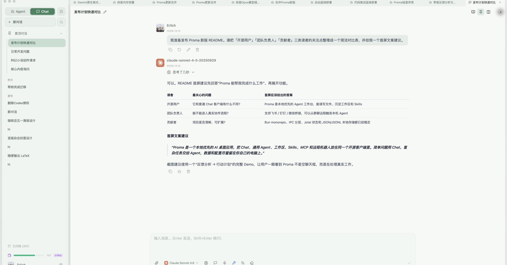
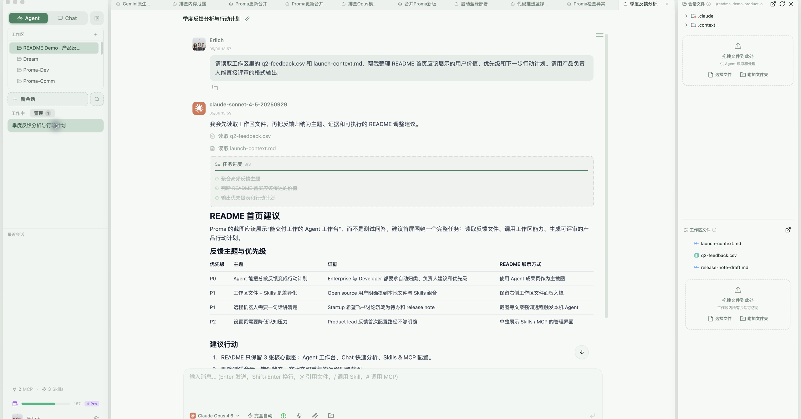
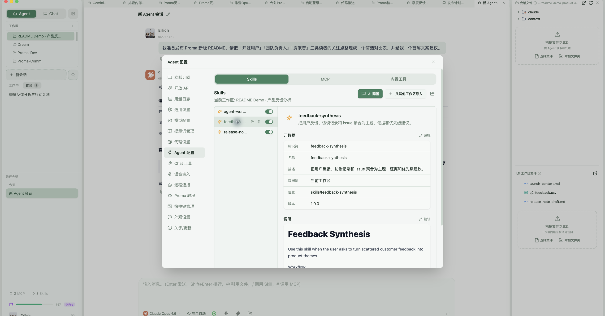
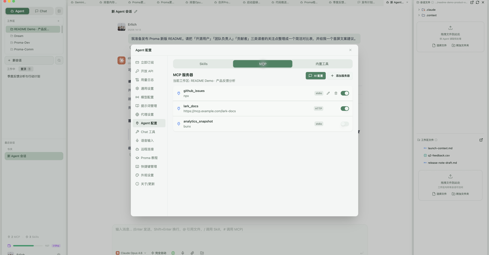
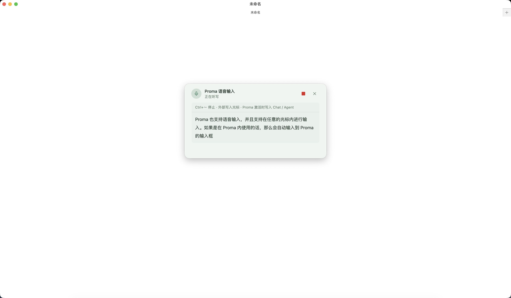

# Proma

Proma 是一个本地优先的 AI 桌面应用，把多模型 Chat、通用 Agent、工作区、Skills、MCP、远程机器人和记忆能力放在同一个开源客户端里。

它不是只面向闲聊的聊天框，而是一个可以长期沉淀个人工作流的 Agent 工作台：简单问题用 Chat，复杂任务交给 Agent，数据和配置尽量留在本地。


<video width="560" controls>
  <source src="https://img.erlich.fun/personal-blog/uPic/%E7%AE%80%E5%8D%95%E4%BB%8B%E7%BB%8D%20Proma.mp4" type="video/mp4">
</video>

[English README](./README.en.md) | [新手教程](./tutorial/tutorial.md) | [下载开源版](https://github.com/ErlichLiu/Proma/releases) | [下载商业版](https://proma.cool/download)

> **最新思考 ｜ 2026 Q2–Q3**：[勇敢地解决真实的问题 — Proactive · 个人注意力 · 团队协作](./proma-thinking/proma-2026-q2-q3-thinking.md) ｜ 往期思考：[2026 Q1](./proma-thinking/proma-2026-q1-thinking.md)

## 现在能做什么

- **Chat 模式**：多模型对话、附件解析、图片输入、Markdown / Mermaid / KaTeX / 代码高亮、并排对话、系统提示词、上下文管理。
- **Agent 模式**：基于 `@anthropic-ai/claude-agent-sdk` 的通用 Agent，支持工作区隔离、权限模式、文件操作、长任务流式输出、计划确认和用户追问。
- **SubAgent / Tasks**：复杂任务可以通过 Claude Agent SDK 的 Agent 工具拆分为子 Agent / Task，并在消息流中展示调用过程和结果。
- **Skills & MCP**：每个工作区可以独立配置 Skills、MCP Server 和工作区文件，适合沉淀可复用能力。
- **远程机器人**：支持飞书 / Lark 机器人桥接，并已提供钉钉、微信桥接入口，用手机或群聊触发本机 Agent 工作流。
- **记忆与工具**：Chat 和 Agent 可共享记忆能力，并支持联网搜索、内置 Chat 工具、Agent 推荐等辅助能力。
- **本地优先**：会话、工作区、附件、配置、Skills 等默认存储在 `~/.proma/`，使用 JSON / JSONL 文件组织，不依赖本地数据库。
- **桌面体验**：自动更新、代理设置、文件预览、全局快捷键、快速任务窗口、语音输入、亮色 / 暗色 / 跟随系统主题。

## 快速开始

### 下载安装

从 [GitHub Releases](https://github.com/ErlichLiu/Proma/releases) 下载开源版本。当前 release notes 以 `v0.9.12` 为准，提供 macOS Apple Silicon、macOS Intel 和 Windows 安装包。

如果你希望开箱即用、减少 API 配置成本，也可以使用 [Proma 商业版](https://proma.cool/download)。商业版和开源版并行运行，主要区别是商业版提供内置渠道和订阅方案。

### 首次配置

1. 打开 Proma，先完成环境检查。Agent 模式依赖本机基础环境，尤其是 Git、Node.js / Bun 以及可用的 Shell。
2. 进入 **设置 > 渠道**，添加至少一个 AI 供应商渠道，填写 Base URL、API Key 和模型列表。
3. Chat 模式可以使用 OpenAI、Anthropic、Google 或 OpenAI 兼容协议的渠道。
4. Agent 模式需要 Anthropic 协议或 Anthropic 兼容协议渠道，例如 Anthropic、DeepSeek、Kimi API、Kimi Coding Plan。
5. 进入 **设置 > Agent**，选择默认 Agent 渠道、模型和工作区。
6. 如需记忆、联网搜索、飞书 / 钉钉 / 微信桥接，在设置页对应 Tab 中继续配置。

## 模式选择

### Chat 适合

- 日常问答、解释、翻译、润色、轻量代码讨论。
- 读取附件内容后做总结、改写、比较。
- 使用联网搜索或记忆工具增强一次性对话。
- 同时对比多个模型输出，或用不同系统提示词做探索。

### Agent 适合

- 修改、创建、整理本地文件。
- 调研、编写报告、处理多步骤任务。
- 使用 MCP、Skills、Shell、Git、项目文件等外部上下文。
- 需要权限确认、计划模式、后台任务或远程机器人持续跟进的工作。

简单说：**只需要回答时用 Chat，需要行动和交付结果时用 Agent。**

## 截图

### Chat 快速分析

用 Chat 处理轻量但真实的分析任务：整理读者关注点、生成对比表，并把首屏文案快速定稿。



### Agent 工作台

Agent 在工作区里读取文件、推进任务、输出表格化结论，并把可复用文件保留在右侧工作区面板中。



### Skills

每个工作区都可以沉淀专属 Skills。截图中的 `feedback-synthesis` 用于把用户反馈、访谈记录和 issue 聚合成主题、证据与优先级建议。



### Skills & MCP

同一个工作区可以管理 stdio / HTTP MCP Server，按需启用或关闭，让 Agent 在不同项目里获得不同的外部上下文。



### 流式语音输入(支持全局输入)
Proma 支持豆包的流式语音输入功能，并且支持在 Proma 内使用和 Proma 外部使用：
- Proma 内部使用：Ctrl + ` 触发识别，再次按下结束自动输入到 Proma 内对应的输入框
- Proma 外部使用：Ctrl + ` 触发识别，再次按下结束自动输入到当前的光标所在处，如无光标则默认写入到剪贴板
- 


## 支持的模型渠道

| 供应商 | Chat | Agent | 协议说明 |
| --- | --- | --- | --- |
| Anthropic | 支持 | 支持 | Anthropic Messages API |
| DeepSeek | 支持 | 支持 | Anthropic 兼容协议 |
| Kimi API | 支持 | 支持 | Anthropic 兼容协议 |
| Kimi Coding Plan | 支持 | 支持 | Anthropic 兼容协议，使用专用认证头 |
| OpenAI | 支持 | 暂不支持 | Chat Completions |
| Google | 支持 | 暂不支持 | Gemini Generative Language API |
| 智谱 AI | 支持 | 支持 | Anthropic 兼容协议 |
| MiniMax | 支持 | 支持 | Anthropic 兼容协议 |
| 豆包 | 支持 | 支持 | Anthropic 兼容协议 |
| 通义千问 | 支持 | 支持 | Anthropic 兼容协议 |
| 自定义端点 | 支持 | 暂不支持 | OpenAI 兼容协议 |

> **Kimi Coding Plan 用户须知**：Proma 已获得 Kimi 官方白名单支持，使用 Proma 连接 Kimi Coding Plan 不会触发第三方客户端封号策略，可放心使用。

Agent 模式底层使用 Claude Agent SDK，因此目前要求渠道提供 Anthropic 或 Anthropic 兼容协议。Chat 模式则通过 `@proma/core` 的 Provider Adapter 统一接入不同协议。

## 本地数据

Proma 采用本地文件存储，方便备份、迁移和排查问题。

```text
~/.proma/
├── channels.json
├── conversations.json
├── conversations/
│   └── {conversation-id}.jsonl
├── agent-sessions.json
├── agent-sessions/
│   └── {session-id}.jsonl
├── agent-workspaces/
│   └── {workspace-slug}/
│       ├── workspace-files/
│       ├── mcp.json
│       └── skills/
├── attachments/
├── user-profile.json
├── settings.json
└── sdk-config/
```

API Key 会通过 Electron `safeStorage` 加密后写入 `channels.json`。Proma 不使用本地数据库，核心数据结构以 JSON 配置和 JSONL 追加日志为主。

## 开发

Proma 是 Bun workspace monorepo。

```text
proma-v2/
├── packages/
│   ├── shared/     # 共享类型、IPC 常量、配置、工具函数
│   ├── core/       # Provider Adapter、SSE、代码高亮
│   └── ui/         # 共享 React UI 组件
└── apps/
    └── electron/   # Electron 桌面应用
```

当前主要包版本：

| 包 | 版本 | 职责 |
| --- | --- | --- |
| `@proma/electron` | `0.10.7` | Electron 桌面应用 |
| `@proma/shared` | `0.1.20` | 共享类型、IPC 常量、配置和工具 |
| `@proma/core` | `0.2.9` | Provider Adapter、SSE、Shiki 高亮 |
| `@proma/ui` | `0.1.6` | 共享 React UI 组件 |

常用命令：

```bash
# 安装依赖
bun install

# 开发模式：自动启动 Vite + Electron + 热重载
bun run dev

# 构建 Electron 应用
bun run electron:build

# 构建并运行
bun run electron:start

# 类型检查
bun run typecheck

# 测试
bun test
```

Electron 子应用内也提供更细的脚本：

```bash
cd apps/electron

bun run dev:vite
bun run dev:electron
bun run build:main
bun run build:preload
bun run build:renderer
bun run dist:fast
```

## 技术栈

| 层级 | 技术 |
| --- | --- |
| 运行时 | Bun |
| 桌面框架 | Electron 39 |
| 前端 | React 18 + TypeScript |
| 状态管理 | Jotai |
| 样式 | Tailwind CSS + Radix UI |
| 富文本输入 | TipTap |
| Markdown / 图表 / 公式 | React Markdown + Beautiful Mermaid + KaTeX |
| 代码高亮 | Shiki |
| 构建 | Vite + esbuild |
| 分发 | electron-builder |
| Agent SDK | `@anthropic-ai/claude-agent-sdk@0.3.143` |

## 架构概览

Proma 的核心通信路径是：

```text
shared 类型和 IPC 常量
  -> main/ipc.ts 注册处理器
  -> preload/index.ts 暴露 window.electronAPI
  -> renderer Jotai atoms 和 React 组件调用
```

主进程服务集中在 `apps/electron/src/main/lib/`：

- `agent-orchestrator.ts`：Agent 编排、环境变量、SDK 调用、事件流、错误处理。
- `agent-session-manager.ts`：Agent 会话索引和 JSONL 消息持久化。
- `agent-workspace-manager.ts`：工作区、MCP、Skills 和工作区文件管理。
- `chat-service.ts`：Chat 流式调用、Provider Adapter、工具活动。
- `conversation-manager.ts`：Chat 会话索引和消息存储。
- `channel-manager.ts`：渠道 CRUD、API Key 加密、连接测试、模型获取。
- `feishu-bridge.ts` / `dingtalk-bridge.ts` / `wechat-bridge.ts`：远程机器人桥接。
- `memory-service.ts`、`chat-tool-*`、`document-parser.ts`、`workspace-watcher.ts`：记忆、工具、文档解析和文件监听。

渲染进程以 Jotai 管理状态，关键 atoms 位于 `apps/electron/src/renderer/atoms/`。Agent IPC 监听器在应用顶层全局挂载，避免切换页面时丢失流式事件、权限请求或后台任务状态。

## 打包注意事项

`@anthropic-ai/claude-agent-sdk` 在 `0.2.113+` 后改为平台 native binary 分发。Proma 的 esbuild 配置会把 SDK 标记为 external，`electron-builder.yml` 会把 SDK 主包和平台子包一起打进安装包。

修改打包配置时请特别确认：

- 主进程 esbuild 保持 `--external:@anthropic-ai/claude-agent-sdk`。
- `apps/electron/package.json` 的 `optionalDependencies` 包含目标平台的 SDK 子包。
- `apps/electron/electron-builder.yml` 的 `files` 包含 SDK 主包和平台子包。
- 其它普通 npm 依赖通常应由 esbuild 打包进 `main.cjs`，不要随意 external。

更完整的工程约定见 [AGENTS.md](./AGENTS.md)。

## 贡献

欢迎修 Bug、补文档、加测试、完善体验，也欢迎围绕真实场景提交新的 Skills、MCP 配置或 Agent 工作流。

提交 PR 前建议先确认：

- 使用 Bun 运行脚本，不混用 npm / pnpm lockfile。
- 状态管理使用 Jotai。
- 尽量保持本地优先，优先使用配置文件和 JSON / JSONL。
- TypeScript 不使用 `any`，对象结构优先使用 `interface`。
- 新增 IPC 时同步修改 shared 类型、main handler、preload bridge 和 renderer 调用。
- 影响包行为时递增对应 package 的 patch 版本。
- 能用测试覆盖的行为尽量补上测试，尤其是共享逻辑、IPC 契约和持久化格式。

Proma 目前设有 PR 赠金计划。提交 PR 时可以在描述中留下邮箱，方便后续发放。


## 作者

- 个人网站：[erlich.fun](https://erlich.fun)

## Star History

<a href="https://www.star-history.com/?repos=ErlichLiu%2FProma&type=date&legend=top-left">
 <picture>
   <source media="(prefers-color-scheme: dark)" srcset="https://api.star-history.com/chart?repos=ErlichLiu/Proma&type=date&theme=dark&legend=top-left" />
   <source media="(prefers-color-scheme: light)" srcset="https://api.star-history.com/chart?repos=ErlichLiu/Proma&type=date&legend=top-left" />
   
 </picture>
</a>


## 致谢

- [Shiki](https://shiki.style/)：代码高亮。
- [Beautiful Mermaid](https://github.com/lukilabs/beautiful-mermaid) 与 [Mermaid](https://mermaid.js.org/)：Mermaid 图表渲染与官方兜底渲染。
- [Cherry Studio](https://github.com/CherryHQ/cherry-studio)：多供应商桌面 AI 产品启发。
- [Lobe Icons](https://github.com/lobehub/lobe-icons)：AI / LLM 品牌图标。
- [Craft Agents OSS](https://github.com/lukilabs/craft-agents-oss)：Agent SDK 集成模式参考。
- [MemOS](https://memos.openmem.net)：记忆能力参考与集成。

## 许可证

Proma 社区版采用 [GNU Affero General Public License v3.0（AGPL-3.0）](./LICENSE) 开源，完整条款见根目录 `LICENSE` 文件。

**个人 / 非商业使用**：自由使用、修改、分发，仅需遵守 AGPL-3.0 条款。

**商业使用**：在完全遵守 AGPL-3.0 条款的前提下允许进行商业使用，包括但不限于：以源代码或修改后的形式分发软件、通过网络对外提供服务时必须公开完整修改源码（含网络交互层）、衍生作品须以 AGPL-3.0 继续授权。

**商业授权（豁免 AGPL-3.0 义务）**：如果你希望将 Proma 集成到闭源产品、对外提供 SaaS 服务但不想公开衍生代码，或有其他无法满足 AGPL-3.0 条款的商业场景，请通过邮件联系获取商业许可：[erlichliu@gmail.com](mailto:erlichliu@gmail.com)。

向本项目提交 Pull Request 即视为同意将贡献以 AGPL-3.0 及未来商业许可形式授权给项目维护者。
